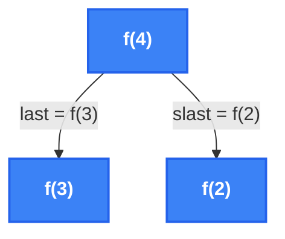
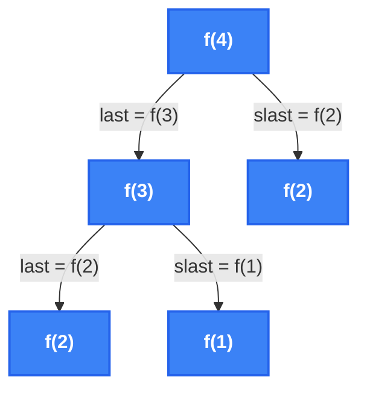
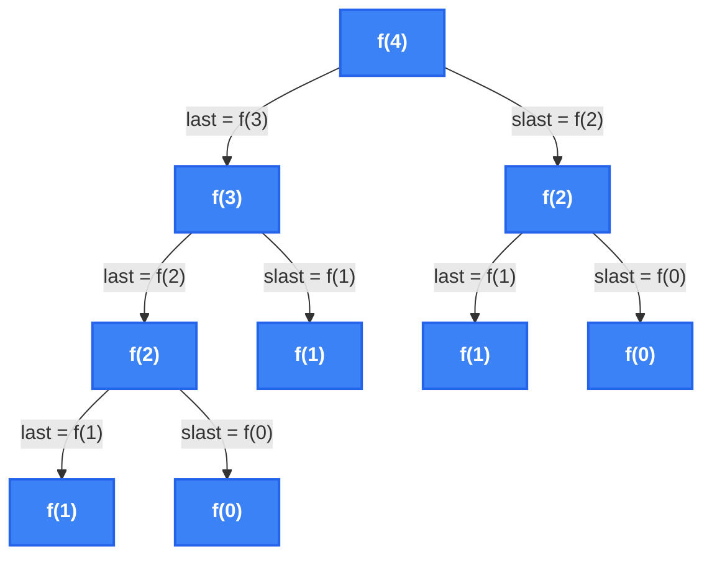
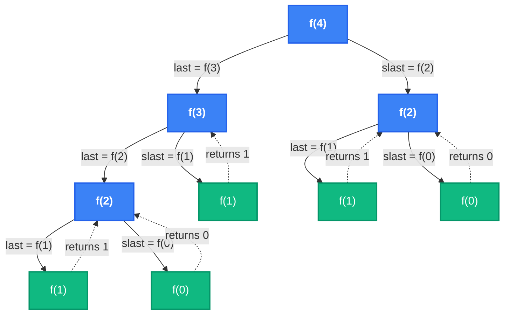
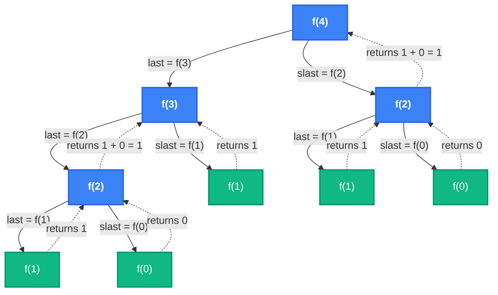
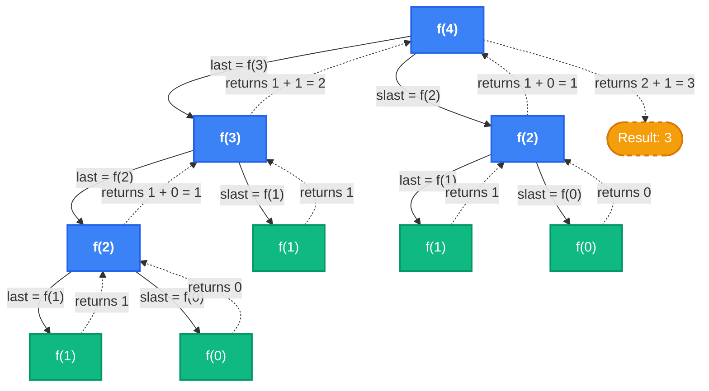

# Fibonacci Recursion Flow (Step-by-Step)

Here is a step-by-step visual breakdown of how the functions are created and called one by one, mimicking the drawing process from your screenshot.

Use the arrows below to click through the steps!

````carousel
### Step 1: The Initial Call
The program starts by calling `f(4)`. It needs to calculate `last = f(3)` and `slast = f(2)`.



<!-- slide -->
### Step 2: Expanding f(3)
`f(3)` now executes and splits into its own `last = f(2)` and `slast = f(1)`.



<!-- slide -->
### Step 3: Expanding f(2)
All `f(2)` calls expand into their base cases `f(1)` and `f(0)`. The tree is now fully built!



<!-- slide -->
### Step 4: Reaching Base Cases
The nodes `f(1)` and `f(0)` are base cases (`n <= 1`), so they immediately return `1` and `0` respectively back to their parent nodes.



<!-- slide -->
### Step 5: Resolving Intermediate Returns
Now the `f(2)` nodes have received both returns (`1` and `0`). They calculate `1 + 0 = 1` and pass this value up to their parent nodes.



<!-- slide -->
### Step 6: Final Calculation
Finally, `f(3)` returns `1 + 1 = 2` back to `f(4)`. `f(4)` adds `2` (from `last`) and `1` (from `slast`) to return the final answer: `3`.


````
